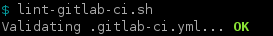
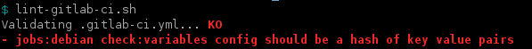
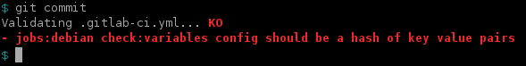

# Gitlab-ci.yml linter script

> Goodbye "yaml invalid" pipeline errors, and don't come back!

This script use the [Gitlab API](https://docs.gitlab.com/ce/api/ci/lint.html) to validate your local `.gitlab-ci.yml`.  
It can be installed as a git pre-commit hook, preventing commit (and so push) of an invalid `.gitlab-ci.yml`. 

**The script itself does not lint anything: it uses the lint API of a Gitlab instance => it needs to be run somewhere with an access to the Gitlab instance where your project come from.**

# Installation

Just download the [lint-gitlab-ci.sh](lint-gitlab-ci.sh) and put it somewhere in your `$PATH`, as an executable.  
And that's all. At least if you already meet the requirements below.

Quick install for Debian-like distribution, including requirements installation:
``` 
sudo apt-get install curl git jq
sudo curl "https://gitlab.com/orobardet/gitlab-ci-linter/raw/master/lint-gitlab-ci.sh" -o /usr/local/bin/lint-gitlab-ci.sh
sudo chmod a+x /usr/local/bin/lint-gitlab-ci.sh
```

## Requirement

- bash 4.x
- [jq](https://stedolan.github.io/jq/) **>=1.5**
- curl
- Some very common Unix command (sed, ls, mkdir, ...) 
- And git client, of course, **in v2+**

Most of these tools already available in most Linux distribution and other Unix-like.  
[jq](https://stedolan.github.io/jq/) package is available in major distibutions, and for other it only consist of a single 
 binary that is available on its website (linux, windows, osx, freebsd, solaris,...)

For Debian-like distributions:
```shell
sudo apt-get install curl git jq
```

# Usage

Once installed, it can be used as a simple standalone script, by launching it from any directory 
inside a git repository clone.

Let's say you have a Gitlab project cloned in `~/dev/my-super-project`:

```shell
cd ~/dev/my-super-project
```
If the `.gitlab-ci.yml` is valid:



You don't need to be in the root of the git repository:
```shell
cd ~/dev/my-super-project/src/public
```
If the `.gitlab-ci.yml` is invalid:



## As git pre-commit hook

The script can be used as a git pre-commit hook. It means it will be run by git automatically each time you ask for a 
commit, and git will stop if your `.gitlab-ci.yml` is invalid:



The script can install (and uninstall) itself as a pre-commit hook, using the options `--install|-i` and `--uninstall|-u`.

The self installation is pretty simple: it will just create a `.git/hooks/pre-commit` file as a symbolic link to itself.

> It means updating the script to a newer version will update all the hooks installed in all your repo => Good!  
> But moving the script will broke commit in these repo until you manually remove the hook and reinstall it => Not so good...  
> Conclusion: install the script in a safe and viable place :)

It won't be able to self install if a `.git/hooks/pre-commit` already exists (and is not a link to itself).
 
Self uninstall will only works if `.git/hooks/pre-commit` is a link to itself.

If you are already using a pre-commit hook, you'll have to install manually: simply add a call to the script in your 
existing pre-commit script.

## Facts

- If no `.gitlab-ci.yml` is detected in the git repository root, the script does noting (if installed as pre-commit hook, it will not prevent the commit).
- The script works (or should) with any instance of Gitlab: gitlab.com or custom instance.
- It uses the url of the remote `origin` to guess the url of the Gitlab to use (also works if the remote is ssh, as soon as the Gitlab respond on HTTP using the same FQDN as ssh)

## --help 

```
Check .gitlab-ci.yml syntax using Gitlab API.

Usage:
 lint-gitlab-ci.sh [--help|--install|--uninstall]

  -h, --help      : show this help
  -i, --install   : install as git pre-commit hook for the current repository
  -u, --uninstall : remove from git pre-commit hook for the current repository

Without any options, it will check the .gitlab-ci.yml of the current local repository.

The current working directory needs to be within a git repository, but not necessary at the repository root.
The git repository needs to have a remote 'origin' set to an instance of gitlab (ssh or http remote).

The script will try to validate only if a .gitlab-ci.yml file exists in the root of the repository.

--install will install the hook as a symbolic link the the current script. The install will failed if a pre-commit hook
already exists (and is not already a link to the script). In that case, you will have to install it manually.
Manual installation only require to add a call to the current script in your existing pre-commit hook.

--uninstall will only remove the pre-commit hook if it is a symbolic link to the current script. Otherwise, you will have
to uninstall it manually.
```

# Contributing/enhancement

It's a quick&dirty script made to fit my needs at work. There is a lot of room to improvement, so feel free to propose MR.

# Development

## Compilation

```shell
go build -i -o ./.build/lint-gitlab-ci -ldflags "-X version.VERSION=2.0.0" gitlab.com/orobardet/gitlab-ci-linter
```